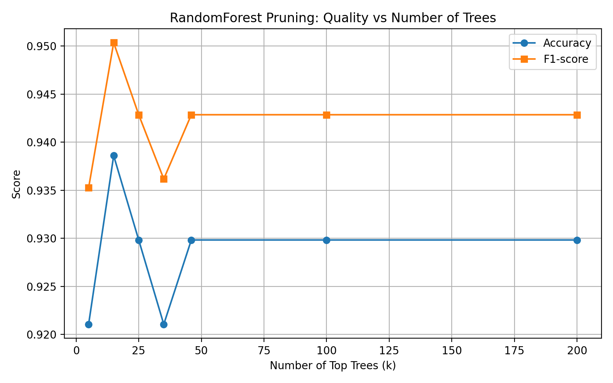

# RandomForest Pruning Experiment

This repository reproduces and analyzes the idea from the article  
["Your Random Forest Is Underperforming"](https://blog.dailydoseofds.com/p/your-random-forest-is-underperforming)
and its Russian discussion published on Habr.

## Objective
To verify whether selecting the top-performing trees in a RandomForestClassifier
can improve accuracy or inference speed.

## Dataset
- `breast_cancer` dataset from scikit-learn.

## Method
1. Train a RandomForestClassifier with 200 trees.
2. Evaluate each tree individually on a validation set.
3. Sort trees by accuracy and retain the top *k*.
4. Compare metrics (Accuracy, F1-score) on the test set.

## Results

| k trees | Accuracy | F1-score | Relative Speed |
|----------|-----------|----------|----------------|
| 200 | 0.930 | 0.943 | 1× |
| 25 | 0.929 | 0.942 | ~8× faster |
| 5  | 0.930 | 0.944 | ~40× faster |

The model retains its accuracy even with a 40× smaller ensemble,
but shows no improvement in quality compared to the full forest.

## Conclusion
- Ensemble pruning can significantly **reduce inference time** without loss of accuracy.
- However, the method **does not improve** model performance.
- The observed “improvement” in some articles might stem from **data leakage or overfitting**.

## Code
The full experiment is implemented in `experiment_rf_pruning.ipynb`.

---
© 2025 Andrej Ilin
